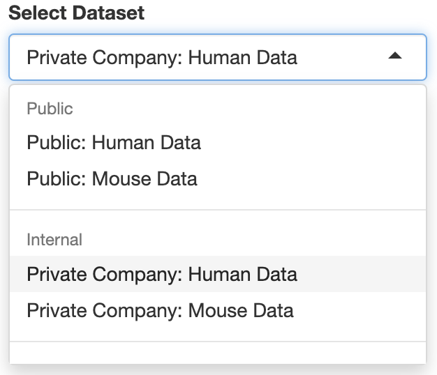

## Overview

This directory is meant to provide assets to test functionality provided by the
`facileDataSetSelect[Server|Input]` module.

## Data Set Directory

A directory that holds a plethora of FacileDataSets to be served up on a platter
may look something like this:

```
parentdir
├── InternalHumanDataSet
|   ├── meta.yaml
│   └── ... more FacileDataSet files ...
├── InternalMouseDataSet
|   ├── meta.yaml
│   └── ... more FacileDataSet files ...
├── PublicHumanDataSet
|   ├── meta.yaml
│   └── ... more FacileDataSet files ...
├── PublicMouseDataSet
|   ├── meta.yaml
│   └── ... more FacileDataSet files ...
├── SomeConsortiumBulkDataSet
|   ├── meta.yaml
│   └── ... more FacileDataSet files ...
├── SomeConsortiumSingleCellDataSet
|   ├── meta.yaml
│   └── ... more FacileDataSet files ...
├── _metadata
│   ├── Homo sapiens
│   │   └── README.md
│   └── Mus musculus
│       └── README.md
└── meta.yaml
```

The top-level elements of `parentdir` are folders that are FacileDataSet objects
serialized on disk. Two other special files exists:

* `parentdir/meta.yaml`: This file gives more information about the datasets
  indlucded in this directory (more on that in the following section); and
* `parentdr/_metadata`: This holds more data that can be associated with the
  datasets at a higher level, like the genesets that can be universally used
  per organism.

## meta.yaml

And the contents of the `meta.yaml` file in the data directory may look like:

```yaml
datasets:
    default: InternalHumanDataSet
    groups:
        Public:
          - PublicHumanDataSet
          - PublicMouseDataSet
        Internal:
          - InternalHumanDataSet
          - InternalMouseDataSet
        "Some Consortium":
          - SomeConsortiumBulkDataSet
          - SomeConsortiumSingleCellDataSet
```

The attributes are nested under a parent `datasets` attribute so that these
can be part of a larger yaml file that might be used to configure a broader
application that these datasets are a part of.

A brief description of those attributes are:

* `default`: A string literal that matches the individual dataset's directory
   name.Note that this is not the value of the `FacileDataSet/meta.yaml::name`
    attribute!
* `groups`: A nested list that describes how the datasets should be groups
   together (or not?) for presentation in a nested selectizeList

When this yaml is combined with the dataset directory structure above, the
`facileDataSetList` module will produce a selectizeInput that looks like:

```{r, include=FALSE, eval=FALSE}
ddir <- system.file("testdata", "fds-directory", package = "FacileShine")
meta.fn <- file.path(ddir, "meta.yaml")z
shiny::shinyApp(
  ui = shiny::fluidPage(
    FacileShine::facileDataSetSelectInput("fdslist")),
  server = function(input, output) {
    FacileShine::facileDataSetSelectServer(
      "fdslist",
      datadir = shiny::reactive(ddir),
      metafn = meta.fn)
  })
```



